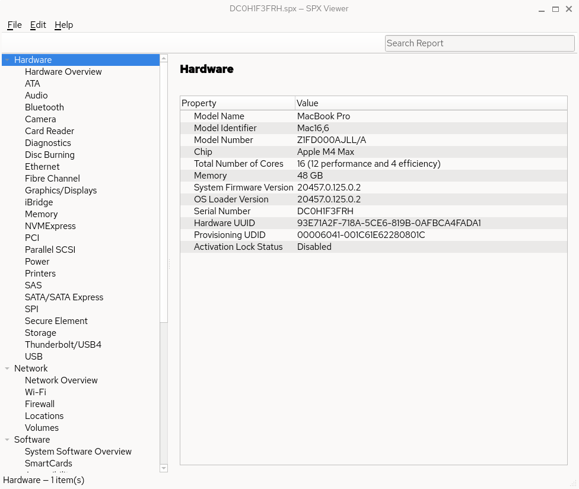

# Apple System Information for Linux

A native Linux desktop viewer for Apple **System Information** `.spx` reports.

On a Mac, System Information can save a full hardware and software report with **File → Save**. This application opens that file on Linux and presents it in a browsable interface similar to Apple’s System Information app.

It does **not** collect information from the Linux computer. It is a viewer for reports generated on macOS.



[Apple’s System Information documentation](https://support.apple.com/guide/system-information/system-information-user-guide-syspr35536/mac) is a useful reference for the kind of data these reports contain.

## What it does

- Opens Apple `.spx` system reports
- Parses the XML/property-list structure instead of showing raw XML
- Builds a sidebar from the categories actually present in the report
- Displays selected information as readable label/value pairs
- Keeps nested data (USB trees, storage volumes, network services) hierarchical
- Uses Apple’s human-friendly labels when they can be determined (`Model Name`, `Serial Number`, `Chip`, and so on)
- Still shows unknown fields rather than hiding them
- Searches category names, field names, and values

Different Macs and macOS versions include different categories. The viewer is generic: sections that exist in the report appear; sections that do not exist are omitted; newer categories still display even if this application has never seen them before.

Typical report areas include Hardware, Memory, Graphics/Displays, Storage, USB, Thunderbolt, Network, Wi-Fi, Bluetooth, Audio, Software, Applications, Extensions, and Installations.

## Requirements

- Linux
- A C++17 compiler (GCC or Clang)
- [CMake](https://cmake.org/) 3.16 or newer
- [Qt 6](https://www.qt.io/) Widgets

### Install build dependencies

**Fedora / RHEL / AlmaLinux / Rocky Linux**

```bash
sudo dnf install gcc-c++ cmake qt6-qtbase-devel
```

**Debian / Ubuntu**

```bash
sudo apt install build-essential cmake qt6-base-dev
```

## Build

```bash
cmake -S . -B build
cmake --build build
```

The binary is `build/spx-viewer`.

## Usage

Start the application:

```bash
./build/spx-viewer
```

Or open a report directly:

```bash
./build/spx-viewer /path/to/report.spx
```

### Opening a report from a Mac

1. On the Mac, open **System Information**.
2. Choose **File → Save**.
3. Copy the `.spx` file to the Linux machine.
4. In this application, choose **File → Open…** (`Ctrl+O`) and select the file.

### Interface

The main window uses a split view:

- **Left:** a navigator tree of report categories, generated from the file
- **Right:** details for the selected category
- **Search:** filter the report by category, field, or value (`Ctrl+F`)

Menus:

| Menu | Command | Shortcut |
| --- | --- | --- |
| File | Open… | Ctrl+O |
| File | Close Report | |
| File | Quit | Ctrl+Q |
| Edit | Find | Ctrl+F |
| Help | About | |

If a file is not valid XML or is not an Apple System Information report, the application shows an error instead of crashing.

## How `.spx` files work

An `.spx` file is an Apple XML property list created by `system_profiler`. The root is an array of dictionaries. Each dictionary is a System Profiler data type with keys such as:

- `_dataType` — internal category identifier (`SPHardwareDataType`, `SPUSBHostDataType`, …)
- `_parentDataType` — parent group (`SPHardwareDataType`, `SPNetworkDataType`, `SPSoftwareDataType`, …)
- `_items` — the actual records
- `_properties` — display metadata such as field order and column flags

The parser reads this recursively into dictionaries, arrays, strings, integers, reals, booleans, dates, and data values. The UI is built from that model, so it can show categories this application was not specifically written to understand.

## Project layout

```text
src/
  main.cpp
  parser/     Plist parser (XML property lists)
  model/      System report tree and human-readable labels
  ui/         Qt Widgets window, sidebar, and detail view
```

## License

[MIT](LICENSE)
